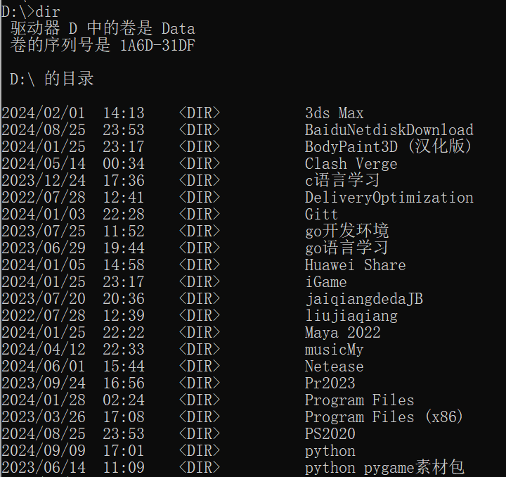
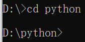
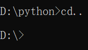
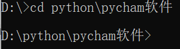
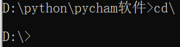

# `CMD`命令提示符

## 一、`CMD`常见命令

- **盘符名称+冒号**
	- 说明：盘符切换
	- 举例：E:回车，表示切换到E盘
	-  
- `dir`
	- 说明：查看当前路径下的内容（包括隐藏文件）
	-  
- `cd`目录
	- 说明：进入单级目录
	- 举例：`cd python`   可以输入`py`然后按`tab`键自动补全`python`
	-  
- `cd..`
	- 说明：回退到上一级目录
	-  
- `cd` 目录1\目录2\\...
	- 说明：进入多级目录
	- 举例：`cd python\pycham软件`
	-  
- `cd\`
	- 说明：回退到盘符目录
	-  
- `cls`
	- 说明：清屏
- `exit`
	- 说明：退出命令提示符窗口

